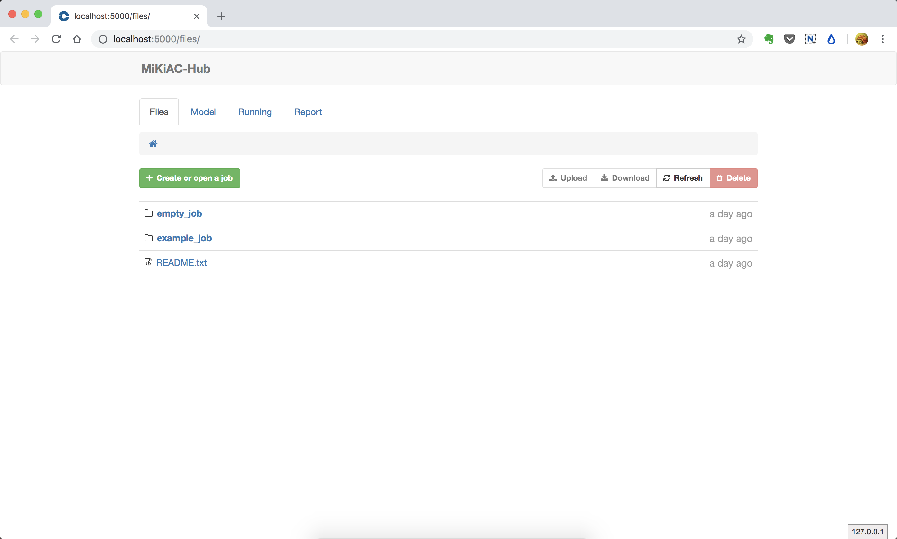

# Installation 

## *scaks* Installation

scaks can be installed in different ways. In current version, scaks has no C or C++ backend code, therefore it can be easily installed even from source code.

### Prerequisite

As scaks provides a higher level Message Passing Interfaces, you need to install an implementation of MPI on your machine before installing mpi4py.

MPI implementations:
1. [MPICH](https://www.mpich.org/)
2. [OpenMPI](https://www.open-mpi.org/)
3. [Microsoft MPI](https://docs.microsoft.com/en-us/message-passing-interface/microsoft-mpi)

### Via Pip (Recommended)

``` shell
pip install scaks
```

### From source

``` shell
git clone --recursive https://github.com/PytLab/scaks.git
cd scaks
python setup.py install
```

### Installation check

To ensure you have installed correctly on your machine, try to import `scaks` in Python shell:

``` python
>>> import scaks
```

#### For developers

We also provide unit tests for developers, if you have clone the repository, just

``` shell
cd scaks/tests
python scaks_test.py
```

## scaks-Hub Installation

### Install and run scaks-Hub example locally

Clone the repository:

``` shell
git clone --recursive git@github.com:PytLab/scaks-hub.git
```

Run the scaks-hub:

``` shell
cd scaks-hub/example
../scaks-hub runserver
```

Your browser will open automatically, if not, open your browser and visit http://localhost:5000



